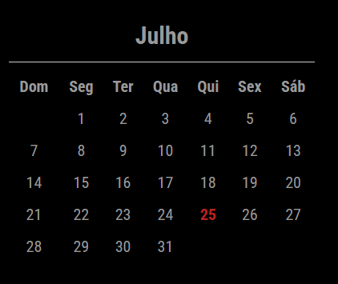

# MMM-MonthCalendar

A Magic Mirror module that displays a monthly calendar with the current day highlighted and a header.



## Features

- Displays a calendar for the current month.
- Highlights the current day in red.
- Includes a header with the text "current month" and a horizontal line below it.
- Updates automatically at midnight and every 3 hours.

## Installation

1. Clone this repository into your MagicMirror's `modules` directory:

    ```bash
    cd ~/MagicMirror/modules
    git clone https://github.com/yourusername/MMM-MonthCalendar.git
    ```

2. Navigate to the module directory and install dependencies:

    ```bash
    cd MMM-MonthCalendar
    npm install
    ```

## Configuration

Add the module to your `config.js` file:

```javascript
{
    module: "MMM-MonthCalendar",
    position: "top_center", // Position where the module should appear
    config: {
        updateInterval: 24 * 60 * 60 * 1000, // Update once a day
        fadeSpeed: 2000, // Fade speed for updates
        daysOfWeek: ["Sun", "Mon", "Tue", "Wed", "Thu", "Fri", "Sat"], // Days of the week, default is English
    }
}
````

## Notes

- Repository URL: https://github.com/juniorrrfagundes/MMM-MonthCalendar
- Author: Junior Rafael Fagundes https://github.com/juniorrrfagundes
